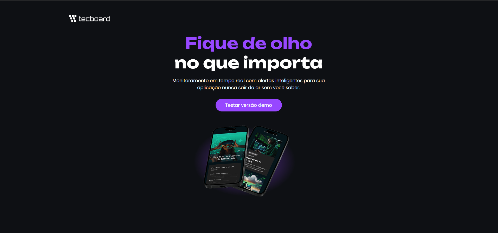

# 💻 Tecboard

Landing page de um produto desenvolvida durante minha jornada de estudos em **Desenvolvimento Front-end**, com foco na estruturação de páginas web, responsividade e organização de projetos.

## 📸 Preview

*Adicione aqui uma captura de tela da landing page do Tecboard.*



## 🚀 Acesse o projeto

🌐 **[Visualizar projeto](https://kaleo-a-m.github.io/Projeto-tecboard/)**

💻 **[Ver código no GitHub](https://github.com/Kaleo-A-M/Projeto-tecboard)**

## 🛠️ Tecnologias utilizadas

* **HTML5** — Estruturação da página.
* **CSS3** — Estilização e desenvolvimento do layout.
* **Media Queries** — Adaptação do layout para diferentes tamanhos de tela.
* **Figma** — Planejamento e prototipação da interface.
* **Git e GitHub** — Versionamento e gerenciamento do projeto.

## 🎨 Sobre o projeto

O Tecboard é uma landing page de um produto, desenvolvida com o objetivo de praticar a construção de interfaces web e aplicar conceitos de desenvolvimento Front-end.

Durante a criação, trabalhei na organização da estrutura da página, na implementação dos estilos e na adaptação do layout para diferentes dispositivos.

## 📱 Responsividade

O projeto utiliza **Media Queries** para adaptar a apresentação da landing page a diferentes tamanhos de tela.

Essa abordagem permitiu praticar a criação de layouts responsivos e compreender como os elementos de uma página podem se reorganizar de acordo com o dispositivo utilizado.

## 📚 Aprendizados

Durante o desenvolvimento do projeto Tecboard, aprendi e pratiquei:

* Criação e estruturação de uma landing page.
* Utilização de Media Queries para responsividade.
* Organização de arquivos e pastas de um projeto Front-end.
* Planejamento de interfaces através do Figma.
* Versionamento de código com Git e GitHub.

## 📂 Estrutura do projeto

```text
Projeto-tecboard/
│
├── fonts/
├── img/
├── favicon-tecboard-preto.svg
├── index.html
└── style.css
```

## 🎯 Objetivo

Este projeto faz parte do meu processo de aprendizado e construção de portfólio como **Desenvolvedor Front-end**.

Busco aprimorar continuamente minhas habilidades em HTML, CSS, responsividade e organização de projetos, desenvolvendo interfaces cada vez mais estruturadas e funcionais.

---

### 👨‍💻 Desenvolvido por Kaléo Maciel

[🔗 Meu GitHub](https://github.com/kaleo-a-m)
